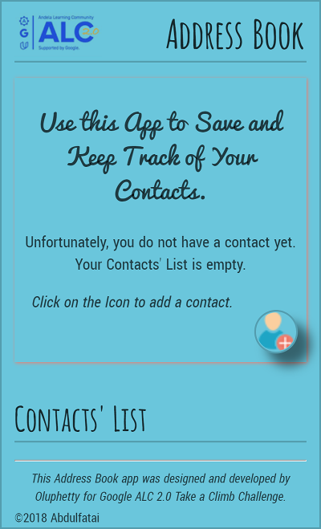
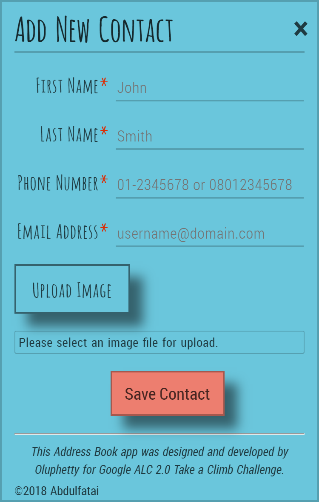
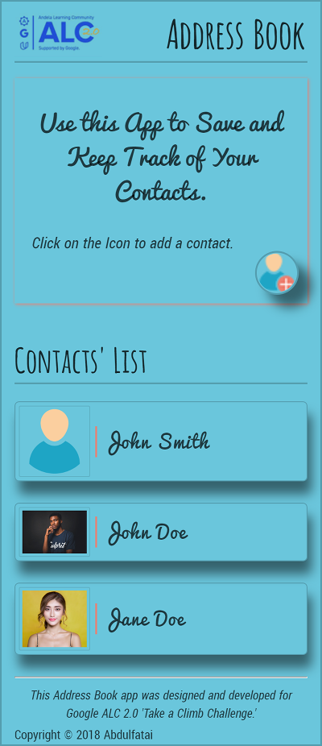
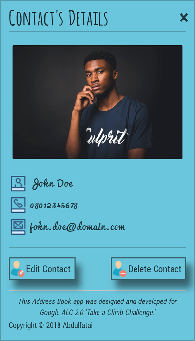

# address-book-app
This is a project for the ALC 2.0 Take a Climb Challenge. The Andela Learning Community program is a collaborative effort of [Andela](https://andela.com), [Google](https://twitter.com/googleafrica), and [Udacity](https://www.udacity.com). This application's features are implemented using native JavaScrip, and it helps to save and keep track of various contacts, their numbers, emails, and, optionally, their images. However, the application does not persist data in any way, so, the app's implementation is focused on frontend

## Getting Started

### Prerequisites
* A text editor or an Integrated Development Environment (IDE)
* A web browser

### Installation
This application does not need any special installation procedures than to clone the repo's folders from GitHub, open the files in a text editor or an IDE, and run the code from a web browser.

## Usage

### Application's Features
* Save a contact and display it in a Contacts' List on the app landing page.
* Click on a contact name to display its details -- name, email, phone number, and image -- on the contact details page.
* Contact edit and delete functionalities.
* Contact form inputs validations to prevent against blank form submission and unusual (invalid) inputs.

### Application's Pages Screenshots

## Built With
* Markup language: HTML5
* Styling language: CSS3
* Frontend scripting language: Native JavaScript (ES5/ES6)
* Image manipulation tools: [GIMP](https://www.gimp.org/) and [TinyPNG](https://tinypng.com/)
* Debugging tool: Chrome DevTools
* Code editor: Microsoft Visual Studio Code Insider
* Versioning control program: Git
